# LensLogic Architecture Documentation

## Table of Contents
1. [Overview](#overview)
2. ### [System Architecture](#system-architecture)
3. [Core Modules](#core-modules)
4. [Process Flows](#process-flows)
5. [Data Flow Diagrams](#data-flow-diagrams)
6. [Configuration System](#configuration-system)
7. [Module Interactions](#module-interactions)
8. [Advanced Features](#advanced-features)

## Overview

LensLogic is a sophisticated photo and video organization tool that leverages metadata extraction to intelligently organize media files. The system follows a modular architecture with clear separation of concerns, comprehensive configuration options, and professional-grade features suitable for both casual users and photography professionals.

### Key Capabilities
- **Intelligent Organization**: Date, location, and camera-based folder structures
- **Metadata Extraction**: Comprehensive EXIF, XMP, and video metadata processing
- **Geolocation Services**: GPS extraction and reverse geocoding
- **Professional Workflows**: Adobe Lightroom/Camera Raw integration
- **Backup & Verification**: Incremental sync with integrity checking
- **Advanced Analytics**: Usage statistics and shooting pattern analysis

## System Architecture

### High-Level Architecture

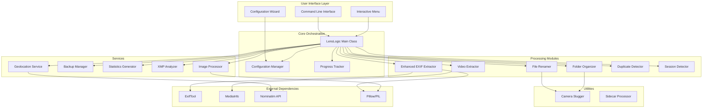

### Component Layers

1. **User Interface Layer**: CLI, Interactive Menu, Configuration Wizard
2. **Core Orchestration**: Main application logic and configuration management
3. **Processing Modules**: Core file processing and organization logic
4. **Services**: Advanced features and analytics
5. **Utilities**: Helper functions and specialized processors
6. **External Dependencies**: Third-party libraries and APIs

## Core Modules

### 1. Enhanced EXIF Extractor (`enhanced_exif_extractor.py`)

**Purpose**: Comprehensive metadata extraction from photos and videos using multiple engines.

**Key Features**:
- Multi-engine support (PyExifTool, PIL, exif library)
- Video metadata integration via MediaInfo
- Metadata caching for performance
- Comprehensive field extraction (camera, GPS, technical settings)

**Key Methods**:
- `extract_metadata(file_path)`: Main extraction method
- `_extract_with_exiftool()`: Professional-grade extraction
- `_extract_gps_with_exiftool()`: GPS data extraction
- `_extract_professional_metadata()`: Advanced camera settings

### 2. Video Extractor (`enhanced_video_extractor.py`)

**Purpose**: Specialized video metadata extraction using MediaInfo.

**Key Features**:
- Support for 20+ video formats
- Technical metadata (codec, bitrate, resolution, duration)
- Audio track information
- Professional video format support

**Key Methods**:
- `extract_metadata(file_path)`: Main video extraction
- `_extract_with_mediainfo()`: MediaInfo integration
- `_process_video_track()`: Video stream analysis
- `_process_audio_track()`: Audio stream analysis

### 3. File Renamer (`file_renamer.py`)

**Purpose**: Intelligent file renaming using metadata-driven templates.

**Key Features**:
- Flexible naming patterns with metadata variables
- Camera name simplification via slugging
- Automatic sequence numbering for duplicates
- Cross-platform filename sanitization

**Template Variables**:
- Date/time: `{year}`, `{month}`, `{day}`, `{time}`
- Camera: `{camera}`, `{camera_make}`, `{camera_model}`
- Technical: `{iso}`, `{f_number}`, `{exposure}`, `{focal_length}`
- Location: `{has_gps}`, `{latitude}`, `{longitude}`

### 4. Folder Organizer (`folder_organizer.py`)

**Purpose**: Dynamic folder structure creation based on metadata.

**Key Features**:
- Date-based hierarchical organization
- Location-aware folder structures
- File type separation (RAW/JPEG/Video)
- Customizable folder templates

**Folder Structure Templates**:
- Basic: `{year}/{month:02d}/{day:02d}`
- With location: `{year}/{month:02d}/{day:02d}/{city}`
- Camera-based: `{year}/{camera}/{month:02d}`

### 5. Geolocation Service (`geolocation.py`)

**Purpose**: GPS coordinate extraction and reverse geocoding.

**Key Features**:
- EXIF GPS data extraction
- Reverse geocoding via Nominatim API
- Location caching to minimize API calls
- KML export for geographic visualization

**Key Methods**:
- `extract_gps_from_metadata()`: GPS coordinate extraction
- `get_location_info()`: Reverse geocoding
- `export_locations_to_kml()`: Geographic data export

### 6. Duplicate Detector (`duplicate_detector.py`)

**Purpose**: Intelligent duplicate file detection and handling.

**Key Features**:
- Multiple detection algorithms (hash, pixel comparison, histogram)
- Configurable actions (skip, rename, move)
- Performance optimization with caching
- Similarity threshold configuration

**Detection Methods**:
- File hash comparison (fastest)
- Pixel-by-pixel comparison (most accurate)
- Histogram analysis (perceptual similarity)

### 7. Session Detector (`session_detector.py`)

**Purpose**: Automatic detection and grouping of photo shooting sessions.

**Key Features**:
- Time-based session detection
- Geographic proximity grouping
- Configurable time and distance thresholds
- Session naming and organization

### 8. Backup Manager (`backup_manager.py`)

**Purpose**: Incremental backup with integrity verification.

**Key Features**:
- Incremental sync (only changed files)
- SHA256 checksum verification
- Multiple destination support
- Progress tracking and statistics

**Key Methods**:
- `incremental_sync()`: Smart backup process
- `verify_backup()`: Integrity checking
- `calculate_file_checksum()`: File integrity validation

### 9. Statistics Generator (`statistics_generator.py`)

**Purpose**: Comprehensive analytics and reporting.

**Key Features**:
- Camera and lens usage statistics
- Shooting pattern analysis
- Matplotlib-based visualization
- Detailed reporting capabilities

**Analytics Provided**:
- Camera brand and model distribution
- Lens usage patterns
- ISO, aperture, and shutter speed trends
- Shooting time patterns
- Location-based statistics

### 10. XMP Analyzer (`xmp_analyzer.py`)

**Purpose**: Professional workflow integration with Adobe products.

**Key Features**:
- XMP sidecar file analysis
- Adobe Lightroom library integration
- Comprehensive metadata reporting
- Professional workflow statistics

## Process Flows

### Main Photo Organization Workflow

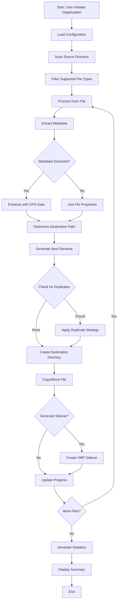

### Metadata Extraction Process

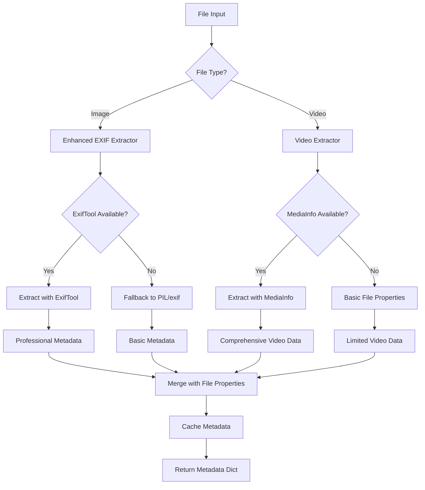

### Configuration Loading Process

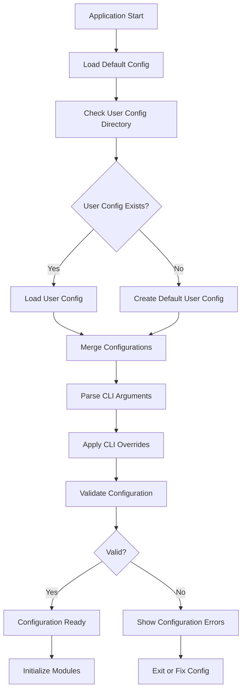

### Geolocation Enhancement Process

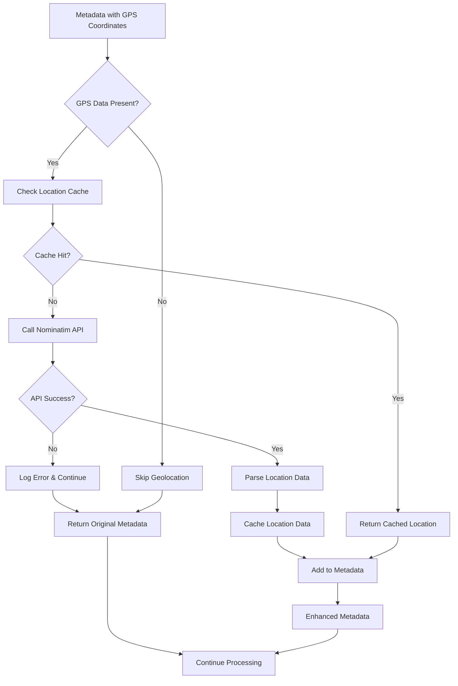

## Data Flow Diagrams

### Overall Data Flow

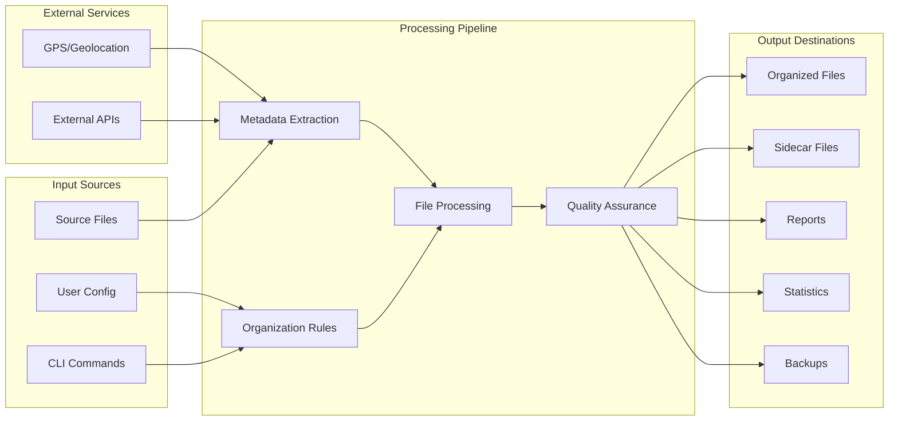

### Module Interaction Flow

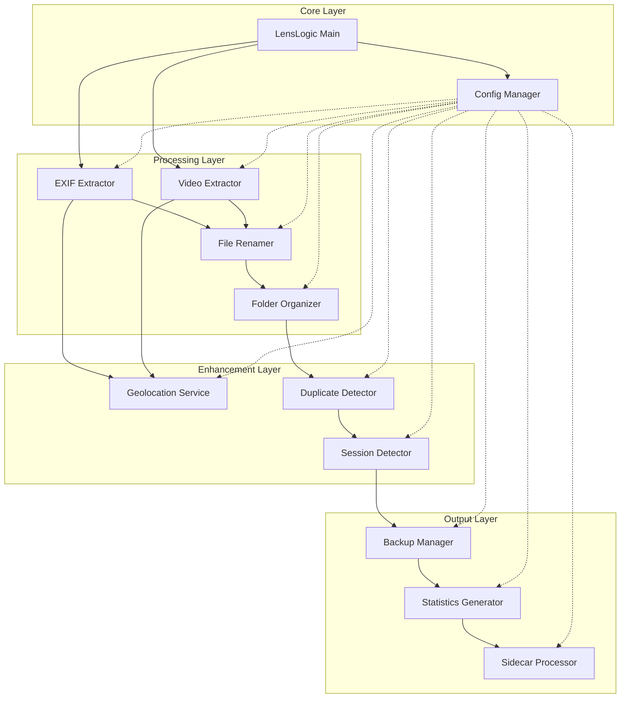

## Configuration System

### Configuration Hierarchy

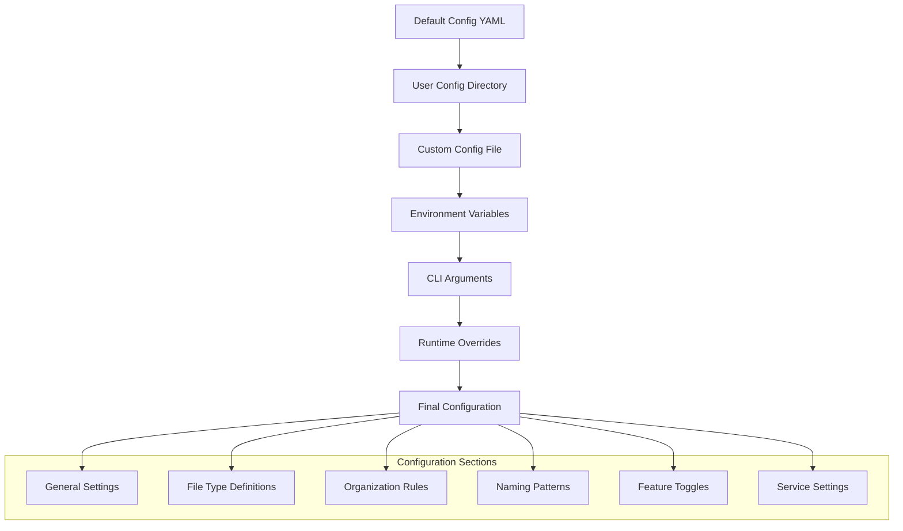

### Configuration Flow

The configuration system follows a hierarchical approach where each level can override the previous:

1. **Default Configuration** (`config/default_config.yaml`): Base settings
2. **User Configuration** (`~/.lenslogic/config.yaml`): User preferences
3. **Custom Configuration**: Specified via `--config` parameter
4. **CLI Arguments**: Command-line overrides
5. **Runtime Updates**: Interactive menu modifications

## Module Interactions

### Metadata Processing Chain

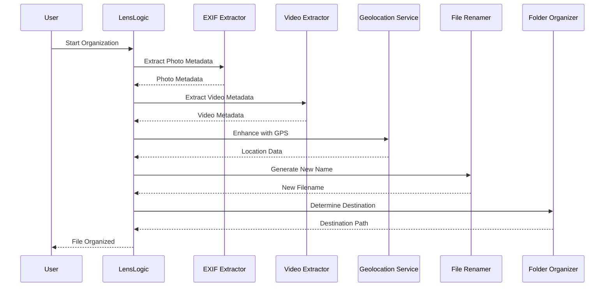

### Backup and Verification Flow

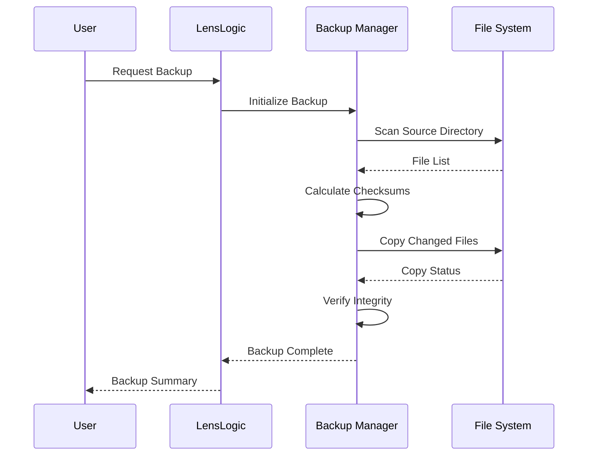

## Advanced Features

### Session Detection Algorithm

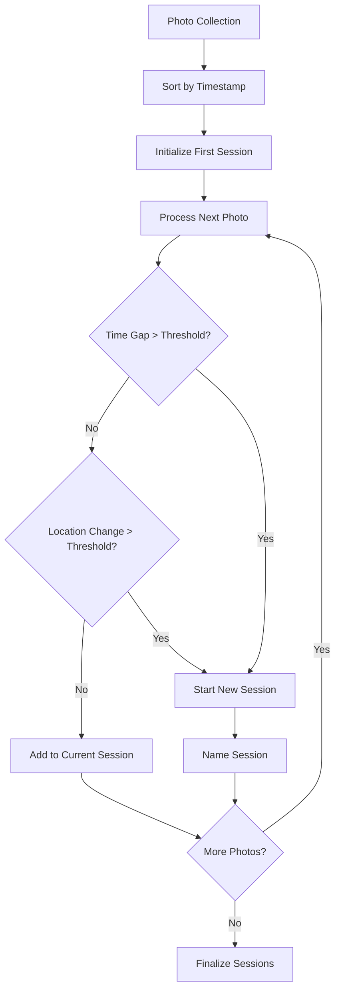

### Duplicate Detection Strategy

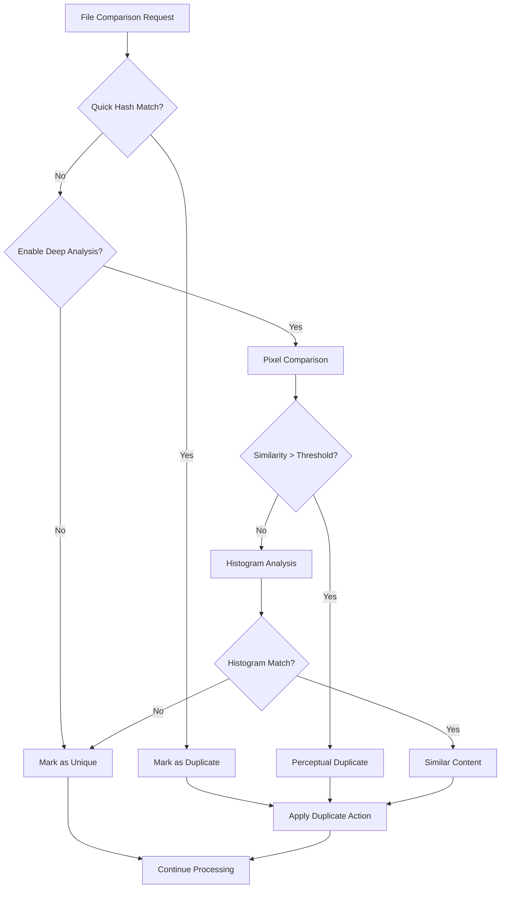

### Performance Optimization

The system implements several performance optimizations:

1. **Metadata Caching**: Avoids re-extracting metadata for unchanged files
2. **Incremental Processing**: Only processes new or modified files
3. **Parallel Processing**: Multi-threaded file processing where appropriate
4. **Memory Management**: Efficient handling of large image files
5. **API Rate Limiting**: Respectful usage of external geolocation services

### Error Handling Strategy

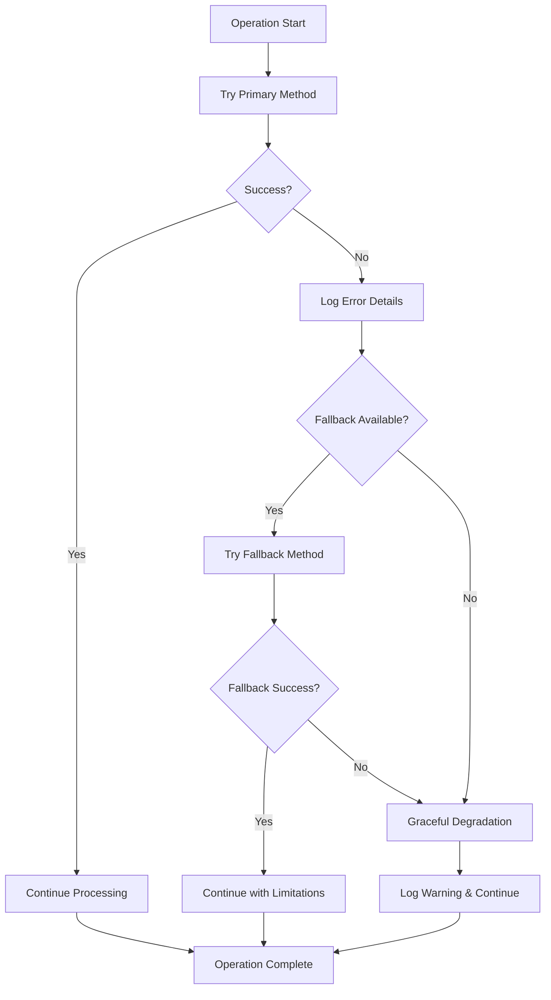

This comprehensive architecture provides a robust, scalable foundation for photo organization with clear separation of concerns, extensive configuration options, and professional-grade features suitable for both casual users and photography professionals.
