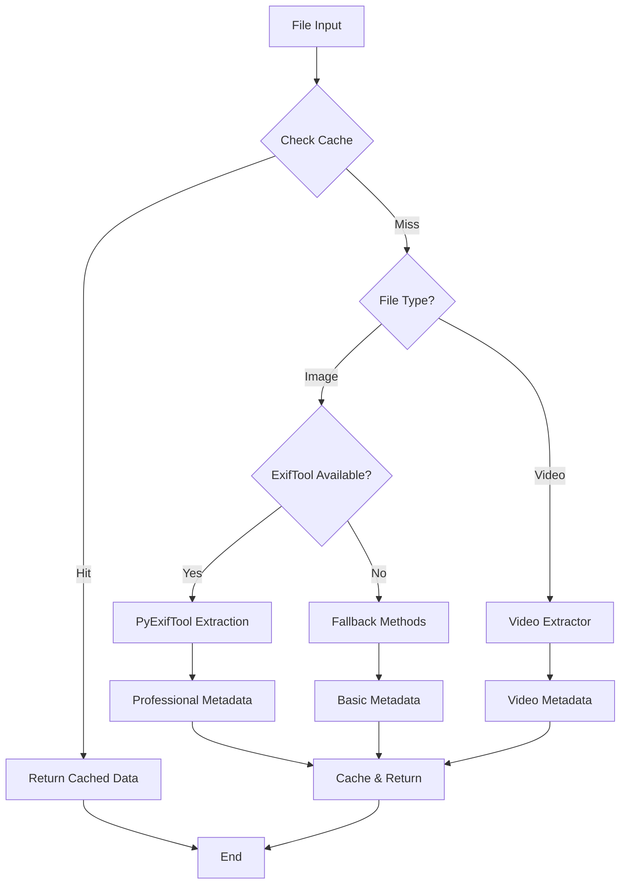
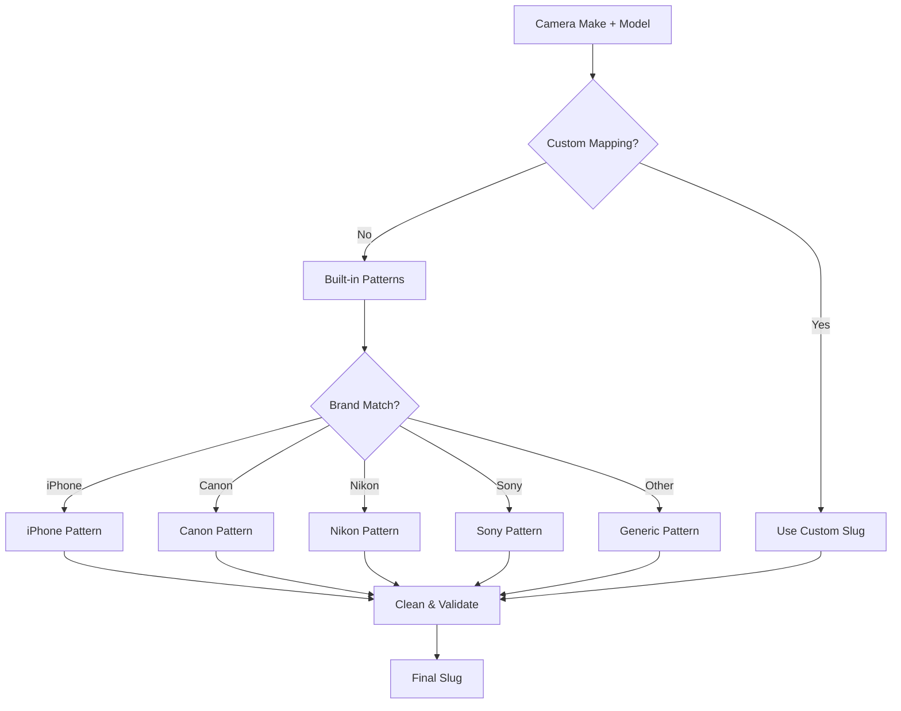
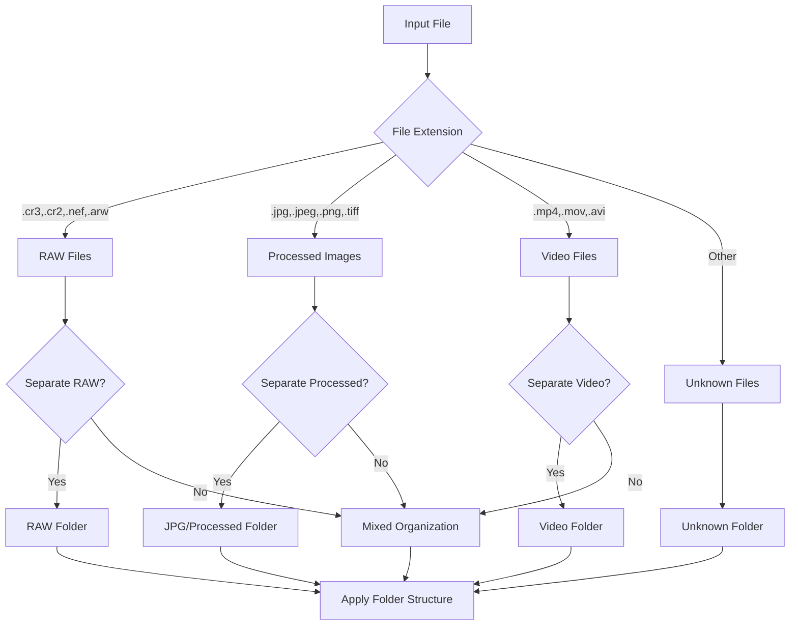
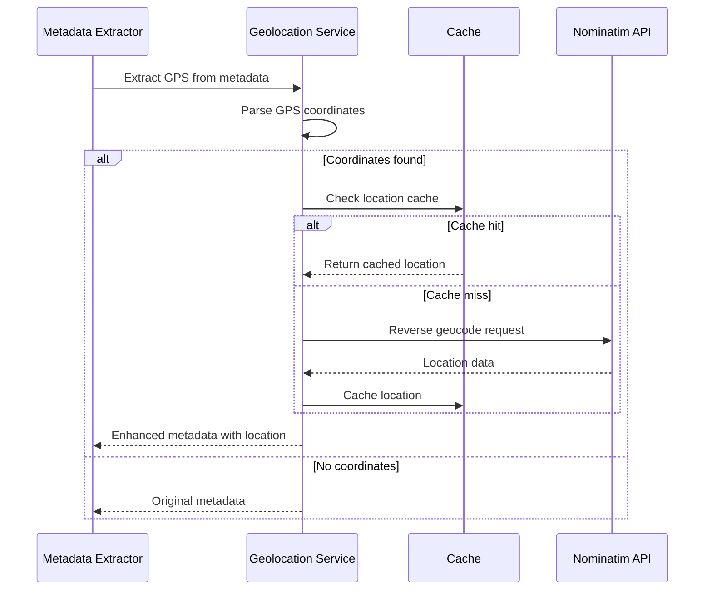
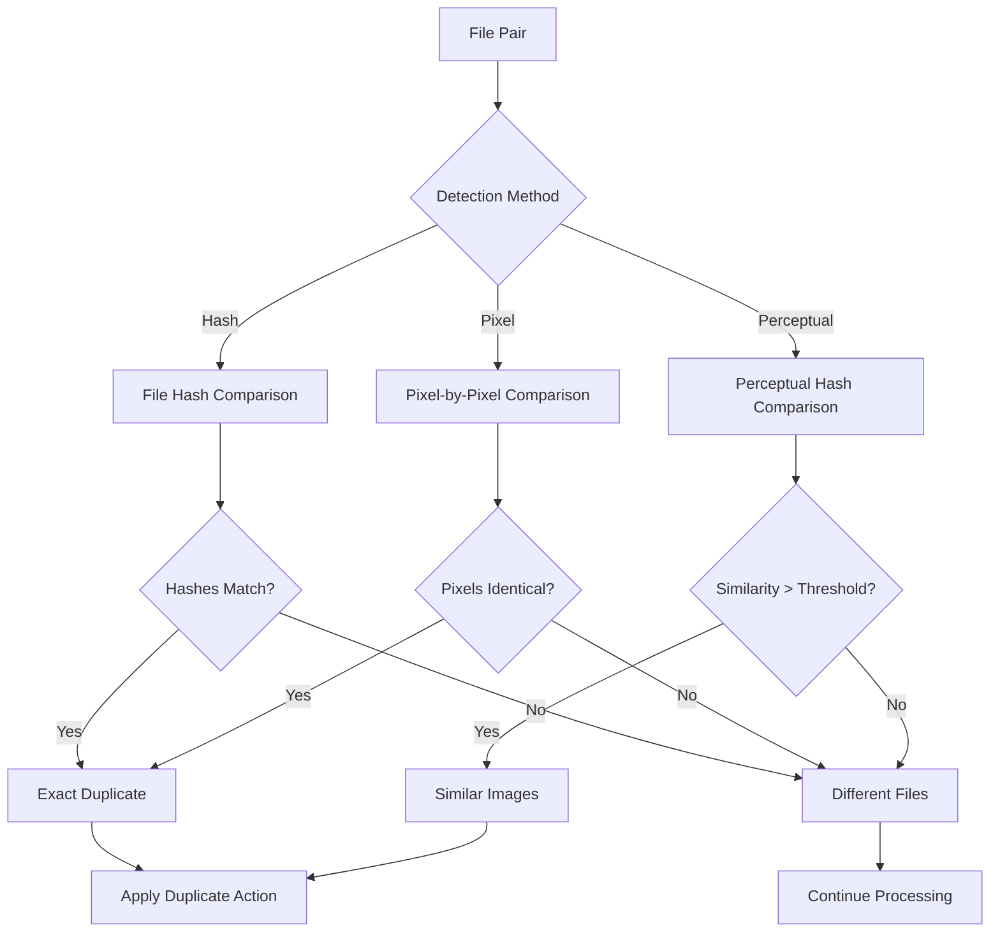
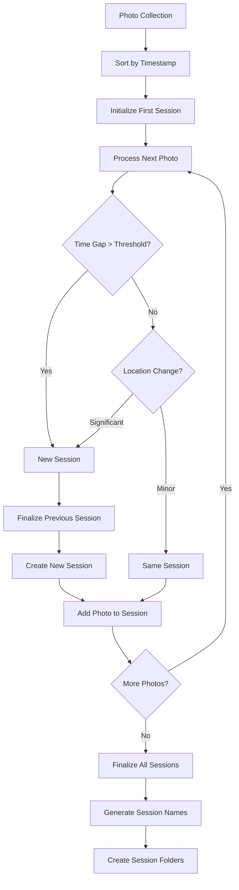
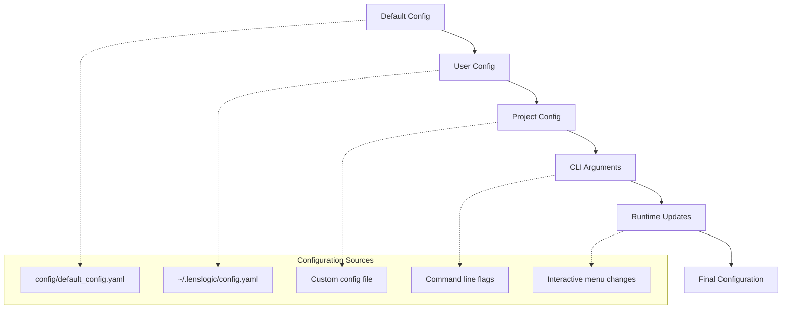

# LensLogic Developer Guide

## Table of Contents
1. [Development Setup](#development-setup)
2. [Project Structure](#project-structure)
3. [Module Deep Dive](#module-deep-dive)
4. [Configuration System](#configuration-system)
5. [Testing Strategy](#testing-strategy)
6. [Extension Points](#extension-points)
7. [Performance Considerations](#performance-considerations)
8. [Contributing Guidelines](#contributing-guidelines)

## Development Setup

### Environment Setup

1. **Python Environment**:
   ```bash
   python -m venv venv
   source venv/bin/activate  # On Windows: venv\Scripts\activate
   pip install -r requirements.txt
   pip install -r requirements-dev.txt
   ```

2. **Development Dependencies**:
   ```bash
   # Core dependencies
   pip install rich questionary pyyaml pillow geopy pathvalidate send2trash

   # Optional professional features
   pip install pyexiftool pymediainfo imagehash

   # Development tools
   pip install pytest pytest-mock ruff mypy black isort
   ```

3. **External Tools**:
   ```bash
   # macOS
   brew install exiftool mediainfo

   # Ubuntu/Debian
   sudo apt-get install libimage-exiftool-perl mediainfo

   # Windows
   # Download ExifTool from https://exiftool.org/
   # Download MediaInfo from https://mediaarea.net/en/MediaInfo
   ```

### IDE Configuration

**VSCode Settings** (`.vscode/settings.json`):
```json
{
    "python.defaultInterpreterPath": "./venv/bin/python",
    "python.linting.enabled": true,
    "python.linting.pylintEnabled": false,
    "python.linting.flake8Enabled": true,
    "python.formatting.provider": "black",
    "python.sortImports.provider": "isort",
    "python.testing.pytestEnabled": true,
    "python.testing.unittestEnabled": false,
    "files.exclude": {
        "**/__pycache__": true,
        "**/.pytest_cache": true,
        "**/venv": true
    }
}
```

### Code Quality Tools

```bash
# Format code
black src/ tests/
isort src/ tests/

# Lint code
ruff check src/ tests/

# Type checking
mypy src/

# Run tests
pytest tests/ -v

# Test coverage
pytest tests/ --cov=src --cov-report=html
```

## Project Structure

```
lenslogic/
├── src/
│   ├── main.py                 # Main application entry point
│   ├── modules/                # Core processing modules
│   │   ├── __init__.py
│   │   ├── enhanced_exif_extractor.py
│   │   ├── enhanced_video_extractor.py
│   │   ├── file_renamer.py
│   │   ├── folder_organizer.py
│   │   ├── geolocation.py
│   │   ├── duplicate_detector.py
│   │   ├── session_detector.py
│   │   ├── backup_manager.py
│   │   ├── statistics_generator.py
│   │   ├── xmp_analyzer.py
│   │   ├── image_processor.py
│   │   ├── interactive_menu.py
│   │   └── config_wizard.py
│   └── utils/                  # Utility modules
│       ├── __init__.py
│       ├── config_manager.py
│       ├── progress_tracker.py
│       └── camera_slugger.py
├── config/
│   └── default_config.yaml     # Default configuration
├── tests/                      # Test suite
│   ├── conftest.py            # Test configuration
│   ├── test_*.py              # Unit tests
│   └── fixtures/              # Test data
├── docs/                      # Documentation
├── requirements.txt           # Production dependencies
├── requirements-dev.txt       # Development dependencies
├── pytest.ini               # Test configuration
├── pyproject.toml           # Project metadata
└── README.md                # Project overview
```

### Module Categories

1. **Core Processing Modules** (`src/modules/`):
   - Metadata extraction and processing
   - File organization and renaming
   - Advanced features (geolocation, duplicates, sessions)

2. **Utility Modules** (`src/utils/`):
   - Configuration management
   - Progress tracking
   - Helper functions

3. **User Interface** (`src/modules/interactive_menu.py`):
   - CLI interface
   - Interactive menus
   - Configuration wizards

## Module Deep Dive

### 1. Enhanced EXIF Extractor (`enhanced_exif_extractor.py`)

**Purpose**: Professional-grade metadata extraction using multiple engines.

#### Key Classes and Methods

```python
class EnhancedExifExtractor:
    def __init__(self):
        self.cache = {}
        self.exiftool_session = None
        self._initialize_exiftool()

    def extract_metadata(self, file_path: str) -> Dict[str, Any]:
        """Main extraction method with caching and fallback support"""
```

#### Extraction Pipeline



#### Metadata Fields Extracted

**Basic Fields**:
- File information (path, size, dates)
- Camera make and model
- Lens information
- Technical settings (ISO, aperture, shutter speed)

**Professional Fields** (ExifTool):
- GPS coordinates and metadata
- Color space and bit depth
- Focus information
- Image quality settings
- Professional camera features

**Implementation Details**:

```python
def _extract_with_exiftool(self, file_path: Path) -> Dict[str, Any]:
    """Extract metadata using PyExifTool"""
    try:
        # Get comprehensive metadata
        exif_data = self.exiftool_session.get_metadata([str(file_path)])[0]

        # Process date/time with priority order
        datetime_fields = [
            'EXIF:DateTimeOriginal',
            'EXIF:CreateDate',
            'EXIF:DateTime'
        ]

        # Extract GPS data
        gps_data = self._extract_gps_with_exiftool(exif_data)

        # Process technical settings
        metadata = self._extract_professional_metadata(exif_data)

        return metadata
    except Exception as e:
        logger.error(f"ExifTool extraction failed: {e}")
        return {}
```

### 2. File Renamer (`file_renamer.py`)

**Purpose**: Intelligent file renaming using metadata-driven templates.

#### Template System

The file renamer uses a flexible template system that supports:

```python
# Template variables available
TEMPLATE_VARIABLES = {
    # Date/Time
    '{year}', '{month}', '{day}', '{hour}', '{minute}', '{second}',
    '{date}', '{time}', '{timestamp}',

    # Camera Information
    '{camera}', '{camera_make}', '{camera_model}',

    # Technical Settings
    '{iso}', '{f_number}', '{exposure}', '{focal_length}',

    # Lens and Equipment
    '{lens}',

    # File Information
    '{original_name}', '{width}', '{height}',

    # Location (if GPS available)
    '{has_gps}', '{latitude}', '{longitude}',

    # Professional Metadata
    '{artist}', '{software}'
}
```

#### Camera Name Slugging



#### Sequence Number Handling

```python
def _add_sequence_number(self, base_name: str, destination_folder: str,
                        extension: str) -> str:
    """Add sequence numbers to prevent filename collisions"""

    # Check for existing files
    existing_files = list(destination_path.glob(f"{base_name}*{extension}"))

    if not existing_files:
        return base_name

    # Find highest sequence number
    max_sequence = 0
    pattern = re.compile(rf"{re.escape(base_name)}_(\d+){re.escape(extension)}$")

    for file in existing_files:
        match = pattern.match(file.name)
        if match:
            max_sequence = max(max_sequence, int(match.group(1)))

    # Return next sequence
    return f"{base_name}_{str(max_sequence + 1).zfill(self.sequence_padding)}"
```

### 3. Folder Organizer (`folder_organizer.py`)

**Purpose**: Dynamic folder structure creation based on metadata and configuration.

#### Folder Structure Templates

```yaml
# Date-based structures
folder_structure: "{year}/{month:02d}/{day:02d}"
folder_structure: "{year}/{month_name}/{day:02d}"
folder_structure: "{year}/{week}"

# Location-enhanced structures
folder_structure_with_location: "{year}/{month:02d}/{city}"
folder_structure_with_location: "{country}/{year}/{month:02d}"

# Camera-based structures
folder_structure: "{camera}/{year}/{month:02d}"
folder_structure: "{year}/{camera}/{month:02d}"

# Custom templates
folder_structure_templates:
  events: "{year}/Events/{month:02d}-{day:02d}"
  travel: "{year}/Travel/{country}/{city}"
  studio: "{year}/Studio/{camera}"
```

#### File Type Organization



### 4. Geolocation Service (`geolocation.py`)

**Purpose**: GPS coordinate extraction and reverse geocoding with caching.

#### GPS Extraction Process



#### Implementation Example

```python
def get_location_info(self, latitude: float, longitude: float) -> Optional[Dict[str, str]]:
    """Get location information from coordinates with caching"""

    if not self.enabled or not self.reverse_geocode:
        return None

    # Create cache key
    cache_key = self._create_cache_key(latitude, longitude)

    # Check cache first
    if cache_key in self.location_cache:
        return self.location_cache[cache_key]

    try:
        # Rate limiting
        if time.time() - self.last_request_time < self.rate_limit_delay:
            time.sleep(self.rate_limit_delay)

        # Reverse geocode
        location = self.geolocator.reverse(f"{latitude}, {longitude}", language='en')

        if location and location.raw:
            location_data = self._parse_location_data(location.raw)
            self.location_cache[cache_key] = location_data
            self._save_cache()
            return location_data

    except (GeocoderTimedOut, GeocoderServiceError) as e:
        logger.warning(f"Geocoding failed: {e}")

    return None
```

### 5. Duplicate Detector (`duplicate_detector.py`)

**Purpose**: Intelligent duplicate detection using multiple algorithms.

#### Detection Algorithms



#### Hash-based Detection

```python
def _calculate_file_hash(self, file_path: Path) -> str:
    """Calculate SHA256 hash of file"""
    hash_obj = hashlib.sha256()

    with open(file_path, 'rb') as f:
        for chunk in iter(lambda: f.read(65536), b''):
            hash_obj.update(chunk)

    return hash_obj.hexdigest()

def _find_hash_duplicates(self, files: List[Path]) -> List[Tuple[Path, Path]]:
    """Find exact duplicates using file hashes"""
    hash_map = defaultdict(list)

    # Calculate hashes
    for file_path in files:
        file_hash = self._calculate_file_hash(file_path)
        hash_map[file_hash].append(file_path)

    # Find duplicates
    duplicates = []
    for file_list in hash_map.values():
        if len(file_list) > 1:
            for i in range(1, len(file_list)):
                duplicates.append((file_list[0], file_list[i]))

    return duplicates
```

#### Perceptual Hash Detection

```python
def _calculate_perceptual_hash(self, file_path: Path) -> str:
    """Calculate perceptual hash for image similarity"""
    try:
        import imagehash
        from PIL import Image

        with Image.open(file_path) as img:
            # Convert to standard format
            if img.mode in ('RGBA', 'LA', 'P'):
                img = img.convert('RGB')

            # Calculate perceptual hash
            phash = imagehash.phash(img, hash_size=16)
            return str(phash)

    except ImportError:
        logger.warning("imagehash library not available for perceptual hashing")
        return ""
    except Exception as e:
        logger.debug(f"Error calculating perceptual hash for {file_path}: {e}")
        return ""
```

### 6. Session Detector (`session_detector.py`)

**Purpose**: Automatic detection and grouping of photo shooting sessions.

#### Session Detection Algorithm



#### Session Naming Strategy

```python
def _generate_session_name(self, session: Dict[str, Any]) -> str:
    """Generate descriptive session names"""

    photos = session['photos']
    if not photos:
        return "Unknown_Session"

    # Get session date range
    start_time = min(p['datetime'] for p in photos if p.get('datetime'))
    end_time = max(p['datetime'] for p in photos if p.get('datetime'))

    # Base name from date
    date_str = start_time.strftime('%Y%m%d')

    # Add time if multiple sessions per day
    if self._has_multiple_sessions_on_date(start_time.date()):
        time_str = start_time.strftime('%H%M')
        date_str += f"_{time_str}"

    # Add location if available
    locations = self._get_session_locations(session)
    if locations:
        primary_location = max(locations.items(), key=lambda x: x[1])[0]
        location_slug = self._clean_location_name(primary_location)
        date_str += f"_{location_slug}"

    # Add photo count
    photo_count = len(photos)
    date_str += f"_{photo_count}photos"

    return date_str
```

### 7. Statistics Generator (`statistics_generator.py`)

**Purpose**: Comprehensive analytics and reporting with visualization.

#### Analytics Categories

1. **Camera Usage Statistics**:
   - Brand and model distribution
   - Usage frequency over time
   - Technical settings analysis

2. **Shooting Pattern Analysis**:
   - Time-based patterns (hour, day, month)
   - Location-based statistics
   - Session duration and frequency

3. **Technical Analysis**:
   - ISO distribution and trends
   - Aperture usage patterns
   - Focal length preferences
   - Exposure settings analysis

#### Visualization Generation

```python
def _generate_camera_usage_chart(self, stats: Dict[str, Any],
                                output_dir: str) -> Optional[str]:
    """Generate camera usage pie chart"""

    camera_stats = stats.get('cameras', {})
    if not camera_stats:
        return None

    # Prepare data
    cameras = list(camera_stats.keys())
    counts = [camera_stats[cam]['count'] for cam in cameras]

    # Create pie chart
    fig, ax = plt.subplots(figsize=(10, 8))

    # Custom colors
    colors = plt.cm.Set3(np.linspace(0, 1, len(cameras)))

    wedges, texts, autotexts = ax.pie(
        counts,
        labels=cameras,
        autopct='%1.1f%%',
        colors=colors,
        startangle=90
    )

    # Styling
    ax.set_title('Camera Usage Distribution', fontsize=16, fontweight='bold')

    # Save chart
    chart_path = os.path.join(output_dir, 'camera_usage.png')
    plt.savefig(chart_path, dpi=300, bbox_inches='tight')
    plt.close()

    return chart_path
```

## Configuration System

### Configuration Hierarchy

The configuration system uses a layered approach:



### Configuration Management

```python
class ConfigManager:
    def __init__(self, config_path: Optional[str] = None):
        self.config_path = config_path
        self.config = {}
        self._load_configuration()

    def _load_configuration(self):
        """Load configuration from multiple sources"""

        # 1. Load default configuration
        default_config = self._load_default_config()

        # 2. Load user configuration
        user_config = self._load_user_config()

        # 3. Load custom configuration if specified
        custom_config = {}
        if self.config_path:
            custom_config = self._load_config_file(self.config_path)

        # 4. Merge configurations (later overrides earlier)
        self.config = self._merge_configs([
            default_config,
            user_config,
            custom_config
        ])

    def update_from_args(self, args: argparse.Namespace):
        """Update configuration from command line arguments"""

        if args.source_directory:
            self.config['general']['source_directory'] = args.source_directory

        if args.destination_directory:
            self.config['general']['destination_directory'] = args.destination_directory

        if args.verbose:
            self.config['general']['verbosity'] = 'DEBUG'

        # Feature flags
        if hasattr(args, 'enable_gps'):
            self.config['features']['extract_gps'] = args.enable_gps
```

### Configuration Validation

```python
def validate_configuration(self) -> List[str]:
    """Validate configuration and return list of errors"""
    errors = []

    # Required fields
    required_fields = [
        'general.source_directory',
        'general.destination_directory',
        'organization.folder_structure'
    ]

    for field in required_fields:
        if not self._get_nested_value(field):
            errors.append(f"Missing required field: {field}")

    # Directory validation
    source_dir = self.config['general']['source_directory']
    if source_dir and not Path(source_dir).exists():
        errors.append(f"Source directory does not exist: {source_dir}")

    # Pattern validation
    naming_pattern = self.config['naming']['pattern']
    if not self._validate_naming_pattern(naming_pattern):
        errors.append(f"Invalid naming pattern: {naming_pattern}")

    return errors
```

## Testing Strategy

### Test Structure

```
tests/
├── conftest.py              # Test configuration and fixtures
├── unit/                    # Unit tests
│   ├── test_exif_extractor.py
│   ├── test_file_renamer.py
│   └── test_*.py
├── integration/             # Integration tests
│   ├── test_full_workflow.py
│   └── test_api_integration.py
├── fixtures/                # Test data
│   ├── sample_images/
│   ├── sample_videos/
│   └── config_files/
└── performance/             # Performance tests
    └── test_large_datasets.py
```

### Test Categories

#### 1. Unit Tests

Test individual modules in isolation:

```python
class TestEnhancedExifExtractor:
    @pytest.fixture
    def extractor(self):
        return EnhancedExifExtractor()

    def test_extract_metadata_jpg(self, extractor, sample_jpg):
        """Test basic JPEG metadata extraction"""
        metadata = extractor.extract_metadata(str(sample_jpg))

        assert metadata['file_path'] == str(sample_jpg)
        assert metadata['file_extension'] == '.jpg'
        assert 'width' in metadata
        assert 'height' in metadata

    def test_extract_metadata_with_gps(self, extractor, sample_jpg_with_gps):
        """Test GPS data extraction"""
        metadata = extractor.extract_metadata(str(sample_jpg_with_gps))

        assert 'gps' in metadata
        assert 'latitude' in metadata['gps']
        assert 'longitude' in metadata['gps']

    @patch('modules.enhanced_exif_extractor.EXIFTOOL_AVAILABLE', False)
    def test_fallback_extraction(self, extractor, sample_jpg):
        """Test fallback when ExifTool unavailable"""
        metadata = extractor.extract_metadata(str(sample_jpg))

        # Should still extract basic metadata
        assert metadata['file_path'] == str(sample_jpg)
        assert 'width' in metadata
```

#### 2. Integration Tests

Test complete workflows:

```python
class TestFullWorkflow:
    def test_organize_mixed_library(self, temp_source_dir, temp_dest_dir, sample_config):
        """Test organizing a mixed photo/video library"""

        # Setup test data
        self._create_test_library(temp_source_dir)

        # Run organization
        lens_logic = LensLogic(config=sample_config)
        result = lens_logic.organize_photos(
            source_dir=str(temp_source_dir),
            destination_dir=str(temp_dest_dir)
        )

        # Verify results
        assert result['total_processed'] > 0
        assert result['errors'] == 0

        # Check folder structure
        expected_folders = [
            'RAW/2024/01',
            'JPG/2024/01',
            'VIDEOS/2024/01'
        ]

        for folder in expected_folders:
            assert (temp_dest_dir / folder).exists()
```

#### 3. Performance Tests

Test performance with large datasets:

```python
class TestPerformance:
    @pytest.mark.slow
    def test_large_library_performance(self, large_test_library):
        """Test performance with 10,000+ files"""

        start_time = time.time()

        extractor = EnhancedExifExtractor()
        results = []

        for file_path in large_test_library:
            metadata = extractor.extract_metadata(str(file_path))
            results.append(metadata)

        duration = time.time() - start_time

        # Performance assertions
        assert duration < 300  # Should complete in under 5 minutes
        assert len(results) == len(large_test_library)

        # Cache effectiveness
        cache_hit_rate = extractor.cache_hits / extractor.total_requests
        assert cache_hit_rate > 0.8  # 80% cache hit rate
```

### Test Fixtures

```python
@pytest.fixture
def sample_config():
    """Standard test configuration"""
    return {
        'general': {
            'verbosity': 'INFO',
            'dry_run': False
        },
        'organization': {
            'folder_structure': '{year}/{month:02d}',
            'separate_raw': True
        },
        'naming': {
            'pattern': '{year}{month:02d}{day:02d}_{original_name}',
            'include_sequence': True
        },
        'features': {
            'extract_gps': True,
            'detect_duplicates': False,
            'generate_sidecars': False
        }
    }

@pytest.fixture
def sample_jpg(temp_dir):
    """Create a sample JPEG with EXIF data"""
    from PIL import Image
    from PIL.ExifTags import TAGS

    # Create test image
    img = Image.new('RGB', (800, 600), color='red')

    # Add EXIF data
    exif_data = {
        'Make': 'Test Camera',
        'Model': 'Test Model',
        'DateTime': '2024:01:15 14:30:22'
    }

    jpg_path = temp_dir / 'test_image.jpg'
    img.save(jpg_path, exif=exif_data)

    return jpg_path
```

## Extension Points

### Custom Metadata Extractors

```python
class CustomMetadataExtractor:
    """Template for custom metadata extractors"""

    def supports_file(self, file_path: Path) -> bool:
        """Check if this extractor supports the file type"""
        raise NotImplementedError

    def extract_metadata(self, file_path: Path) -> Dict[str, Any]:
        """Extract metadata from file"""
        raise NotImplementedError

    def get_priority(self) -> int:
        """Return priority (higher = more preferred)"""
        return 0

# Register custom extractor
from modules.enhanced_exif_extractor import EnhancedExifExtractor

class CustomExifExtractor(EnhancedExifExtractor):
    def __init__(self):
        super().__init__()
        self.custom_extractors = []

    def register_extractor(self, extractor: CustomMetadataExtractor):
        """Register a custom metadata extractor"""
        self.custom_extractors.append(extractor)
        # Sort by priority
        self.custom_extractors.sort(key=lambda x: x.get_priority(), reverse=True)
```

### Custom File Processors

```python
class FileProcessor:
    """Template for custom file processors"""

    def can_process(self, file_path: Path, metadata: Dict[str, Any]) -> bool:
        """Check if this processor can handle the file"""
        raise NotImplementedError

    def process_file(self, file_path: Path, metadata: Dict[str, Any],
                    config: Dict[str, Any]) -> Dict[str, Any]:
        """Process the file and return results"""
        raise NotImplementedError

# Example: Custom RAW processor
class RawProcessor(FileProcessor):
    def can_process(self, file_path: Path, metadata: Dict[str, Any]) -> bool:
        return file_path.suffix.lower() in ['.cr3', '.cr2', '.nef', '.arw']

    def process_file(self, file_path: Path, metadata: Dict[str, Any],
                    config: Dict[str, Any]) -> Dict[str, Any]:
        # Custom RAW processing logic
        result = {
            'processed': True,
            'raw_settings_applied': True,
            'output_files': []
        }

        # Apply custom RAW processing
        # ...

        return result
```

### Plugin System

```python
class PluginManager:
    """Manage LensLogic plugins"""

    def __init__(self):
        self.plugins = {}
        self.hooks = defaultdict(list)

    def register_plugin(self, plugin_name: str, plugin_class):
        """Register a plugin"""
        self.plugins[plugin_name] = plugin_class()

        # Register hooks
        if hasattr(plugin_class, 'HOOKS'):
            for hook_name in plugin_class.HOOKS:
                self.hooks[hook_name].append(self.plugins[plugin_name])

    def execute_hook(self, hook_name: str, *args, **kwargs):
        """Execute all plugins registered for a hook"""
        results = []

        for plugin in self.hooks[hook_name]:
            if hasattr(plugin, hook_name):
                result = getattr(plugin, hook_name)(*args, **kwargs)
                results.append(result)

        return results

# Example plugin
class WatermarkPlugin:
    """Add watermarks to processed images"""

    HOOKS = ['post_image_process']

    def post_image_process(self, image_path: Path, metadata: Dict[str, Any]):
        """Add watermark after image processing"""
        # Watermark logic
        pass
```

## Performance Considerations

### Memory Management

```python
class MemoryEfficientProcessor:
    """Process files with memory constraints"""

    def __init__(self, max_memory_mb: int = 1024):
        self.max_memory_mb = max_memory_mb
        self.current_memory_usage = 0

    def process_files_in_batches(self, file_list: List[Path],
                                batch_size: int = 100):
        """Process files in memory-efficient batches"""

        for i in range(0, len(file_list), batch_size):
            batch = file_list[i:i + batch_size]

            # Process batch
            for file_path in batch:
                # Check memory usage
                if self._get_memory_usage() > self.max_memory_mb:
                    self._cleanup_cache()

                self._process_file(file_path)

            # Cleanup after batch
            self._cleanup_batch()

    def _get_memory_usage(self) -> int:
        """Get current memory usage in MB"""
        import psutil
        process = psutil.Process()
        return process.memory_info().rss / 1024 / 1024
```

### Caching Strategies

```python
class SmartCache:
    """Intelligent caching with memory and disk fallback"""

    def __init__(self, memory_limit: int = 1000, disk_cache_dir: str = None):
        self.memory_cache = {}
        self.memory_limit = memory_limit
        self.disk_cache_dir = Path(disk_cache_dir) if disk_cache_dir else None
        self.access_times = {}

    def get(self, key: str) -> Optional[Any]:
        """Get cached value with LRU eviction"""

        # Try memory cache first
        if key in self.memory_cache:
            self.access_times[key] = time.time()
            return self.memory_cache[key]

        # Try disk cache
        if self.disk_cache_dir:
            cache_file = self.disk_cache_dir / f"{hashlib.md5(key.encode()).hexdigest()}.json"
            if cache_file.exists():
                with open(cache_file, 'r') as f:
                    data = json.load(f)

                # Promote to memory cache
                self._set_memory(key, data)
                return data

        return None

    def set(self, key: str, value: Any):
        """Set cached value with overflow to disk"""

        # Try memory cache first
        if len(self.memory_cache) < self.memory_limit:
            self._set_memory(key, value)
        else:
            # Evict LRU item
            self._evict_lru()
            self._set_memory(key, value)

        # Also save to disk cache if configured
        if self.disk_cache_dir:
            self._save_to_disk(key, value)
```

### Parallel Processing

```python
from concurrent.futures import ThreadPoolExecutor, as_completed
import multiprocessing

class ParallelProcessor:
    """Process files in parallel for better performance"""

    def __init__(self, max_workers: Optional[int] = None):
        self.max_workers = max_workers or min(32, multiprocessing.cpu_count() + 4)

    def process_files_parallel(self, file_list: List[Path],
                              processor_func: callable) -> List[Dict[str, Any]]:
        """Process files in parallel using thread pool"""

        results = []

        with ThreadPoolExecutor(max_workers=self.max_workers) as executor:
            # Submit all tasks
            future_to_file = {
                executor.submit(processor_func, file_path): file_path
                for file_path in file_list
            }

            # Collect results as they complete
            for future in as_completed(future_to_file):
                file_path = future_to_file[future]

                try:
                    result = future.result()
                    results.append(result)
                except Exception as e:
                    logger.error(f"Error processing {file_path}: {e}")
                    results.append({
                        'file_path': str(file_path),
                        'error': str(e)
                    })

        return results
```

## Contributing Guidelines

### Code Style

1. **Follow PEP 8**: Use Black formatter and isort for imports
2. **Type Hints**: Use type hints for all public APIs
3. **Docstrings**: Use Google-style docstrings
4. **Error Handling**: Use specific exception types

### Git Workflow

```bash
# Feature development
git checkout -b feature/new-metadata-extractor
git commit -m "Add support for HEIC metadata extraction"
git push origin feature/new-metadata-extractor

# Create pull request with:
# - Clear description
# - Test coverage
# - Documentation updates
```

### Pull Request Guidelines

1. **Tests**: All new features must have tests
2. **Documentation**: Update relevant documentation
3. **Performance**: Consider performance impact
4. **Backwards Compatibility**: Maintain API compatibility

### Release Process

```bash
# Version bump
bump2version minor  # or major/patch

# Build and test
python -m build
twine check dist/*

# Release
git push --tags
twine upload dist/*
```

This developer guide provides comprehensive information for understanding, extending, and contributing to LensLogic. The modular architecture and extensive configuration system make it easy to add new features while maintaining backwards compatibility.