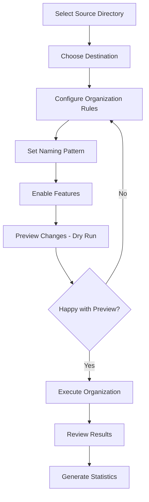

# LensLogic User Guide

## Table of Contents
1. [Getting Started](#getting-started)
2. [Configuration](#configuration)
3. [Basic Usage](#basic-usage)
4. [Advanced Features](#advanced-features)
5. [Command Reference](#command-reference)
6. [Configuration Reference](#configuration-reference)
7. [Troubleshooting](#troubleshooting)
8. [Use Cases & Examples](#use-cases--examples)

## Getting Started

### Installation

1. **Clone the repository**:
   ```bash
   git clone https://github.com/your-repo/lenslogic.git
   cd lenslogic
   ```

2. **Install dependencies**:
   ```bash
   pip install -r requirements.txt
   ```

3. **Install optional dependencies for enhanced features**:
   ```bash
   # For professional metadata extraction
   pip install pyexiftool

   # For video metadata
   pip install pymediainfo

   # For advanced duplicate detection
   pip install imagehash
   ```

4. **Run the setup wizard**:
   ```bash
   python src/main.py --setup
   ```

### Quick Start

The fastest way to get started is using the interactive menu:

```bash
python src/main.py --interactive
```

This will launch a user-friendly menu system that guides you through:
- Configuration setup
- Source and destination selection
- Feature configuration
- Processing options

## Configuration

### Configuration Files

LensLogic uses a hierarchical configuration system:

1. **Default Configuration**: `config/default_config.yaml` (base settings)
2. **User Configuration**: `~/.lenslogic/config.yaml` (your preferences)
3. **Custom Configuration**: Specified via `--config` parameter

### Configuration Wizard

Run the configuration wizard to set up your preferences interactively:

```bash
python src/main.py --config-wizard
```

The wizard will guide you through:
- **Source Directories**: Where your photos are located
- **Destination Structure**: How you want files organized
- **Naming Patterns**: How files should be renamed
- **Feature Toggles**: Which advanced features to enable
- **Service Settings**: API keys and external service configuration

### Basic Configuration Example

```yaml
general:
  source_directory: "/Users/username/Pictures/Unsorted"
  destination_directory: "/Users/username/Pictures/Organized"
  verbosity: "INFO"

organization:
  folder_structure: "{year}/{month:02d}/{day:02d}"
  separate_raw: true
  raw_folder: "RAW"
  jpg_folder: "PROCESSED"

naming:
  pattern: "{year}{month:02d}{day:02d}_{camera}_{original_name}"
  include_sequence: true
  lowercase_extension: true

features:
  extract_gps: true
  detect_duplicates: true
  generate_sidecars: true
```

## Basic Usage

### Command Line Interface

#### Organize Photos with Default Settings

```bash
python src/main.py --source "/path/to/photos" --destination "/path/to/organized"
```

#### Dry Run (Preview Changes)

```bash
python src/main.py --source "/path/to/photos" --destination "/path/to/organized" --dry-run
```

#### Organize with Custom Configuration

```bash
python src/main.py --config "/path/to/custom_config.yaml" --source "/path/to/photos"
```

#### Verbose Output

```bash
python src/main.py --source "/path/to/photos" --destination "/path/to/organized" --verbose
```

### Interactive Menu

For a user-friendly experience, use the interactive menu:

```bash
python src/main.py --interactive
```

**Menu Options**:
1. **Quick Organization**: Fast setup for basic organization
2. **Advanced Setup**: Detailed configuration options
3. **View Configuration**: Display current settings
4. **Generate Statistics**: Analyze your photo library
5. **Backup Management**: Setup and verify backups
6. **XMP Analysis**: Analyze Adobe Lightroom libraries

### Processing Workflow



## Advanced Features

### 1. Geolocation Enhancement

Extract and enhance GPS data from your photos:

```bash
python src/main.py --source "/path/to/photos" --enable-gps --destination "/path/to/organized"
```

**Features**:
- Extracts GPS coordinates from EXIF data
- Performs reverse geocoding to get location names
- Organizes photos by location if desired
- Exports KML files for mapping

**Configuration**:
```yaml
geolocation:
  add_location_to_folder: true
  location_components: "city"  # Options: city, country, city_country
  cache_locations: true
  export_kml: true
```

### 2. Session Detection

Automatically group photos into shooting sessions:

```bash
python src/main.py --detect-sessions --source "/path/to/photos"
```

**How it works**:
- Groups photos by time gaps (default: 2 hours)
- Considers location changes
- Creates session folders
- Names sessions based on location or date

**Configuration**:
```yaml
session_detection:
  time_threshold_hours: 2
  location_threshold_km: 5
  create_session_folders: true
  session_naming: "auto"  # Options: auto, date, location
```

### 3. Duplicate Detection

Intelligent duplicate detection with multiple algorithms:

```bash
python src/main.py --detect-duplicates --source "/path/to/photos"
```

**Detection Methods**:
- **Hash-based**: Exact file matches (fastest)
- **Pixel comparison**: Identical images (most accurate)
- **Perceptual hashing**: Similar images (most flexible)

**Actions for Duplicates**:
- **Skip**: Leave duplicates in place
- **Rename**: Add sequence numbers
- **Move**: Move to a duplicates folder
- **Interactive**: Ask user for each duplicate

**Configuration**:
```yaml
duplicate_detection:
  method: "hash"  # Options: hash, pixel, perceptual
  action: "rename"  # Options: skip, rename, move, interactive
  similarity_threshold: 0.95
  move_to_folder: "DUPLICATES"
```

### 4. Professional Video Support

Enhanced video metadata extraction:

```bash
python src/main.py --source "/path/to/videos" --video-analysis
```

**Supported Formats**:
- MP4, MOV, AVI, MKV, WMV, FLV, WebM
- Professional formats: ProRes, DNxHD, R3D, BRAW

**Extracted Data**:
- Video codec and quality settings
- Resolution and frame rate
- Audio codec and channels
- Recording device information
- GPS data from cameras with location services

### 5. Backup and Verification

Incremental backup with integrity checking:

```bash
python src/main.py --backup --source "/path/to/organized" --backup-destination "/path/to/backup"
```

**Features**:
- Incremental sync (only changed files)
- SHA256 checksum verification
- Multiple backup destinations
- Detailed progress tracking

**Verification**:
```bash
python src/main.py --verify-backup --source "/path/to/organized" --backup-destination "/path/to/backup"
```

### 6. XMP Sidecar Generation

Create XMP sidecar files for RAW processors:

```bash
python src/main.py --generate-sidecars --source "/path/to/organized"
```

**Sidecar Contents**:
- All extracted metadata
- GPS coordinates
- Camera and lens information
- Technical settings
- Keywords and ratings (if present)

### 7. Statistics and Analytics

Generate comprehensive library statistics:

```bash
python src/main.py --analyze --source "/path/to/organized"
```

**Analytics Include**:
- Camera and lens usage statistics
- Shooting pattern analysis
- Technical setting distributions
- Location-based statistics
- Time-based trends

## Command Reference

### Core Commands

| Command | Description | Example |
|---------|-------------|---------|
| `--source` | Source directory containing photos | `--source "/Users/photos"` |
| `--destination` | Destination for organized photos | `--destination "/Users/organized"` |
| `--custom-destination` | Custom destination for this run only (doesn't modify config) | `--custom-destination "/Users/client-project"` |
| `--config` | Custom configuration file | `--config "my_config.yaml"` |
| `--dry-run` | Preview changes without executing | `--dry-run` |
| `--verbose` | Enable detailed logging | `--verbose` |
| `--interactive` | Launch interactive menu | `--interactive` |

### Feature Flags

| Flag | Description | Default |
|------|-------------|---------|
| `--enable-gps` | Extract and enhance GPS data | Enabled |
| `--detect-duplicates` | Enable duplicate detection | Disabled |
| `--detect-sessions` | Group photos into sessions | Disabled |
| `--generate-sidecars` | Create XMP sidecar files | Disabled |
| `--video-analysis` | Enhanced video metadata | Enabled |
| `--backup` | Enable backup mode | Disabled |

### Analysis Commands

| Command | Description |
|---------|-------------|
| `--analyze` | Generate library statistics |
| `--xmp-analyze` | Analyze XMP library |
| `--verify-backup` | Verify backup integrity |

### Setup Commands

| Command | Description |
|---------|-------------|
| `--setup` | Run initial setup wizard |
| `--config-wizard` | Interactive configuration |
| `--reset-config` | Reset to default configuration |

## Configuration Reference

### File Naming Patterns

Use metadata variables in your naming patterns:

```yaml
naming:
  pattern: "{year}{month:02d}{day:02d}_{camera}_{original_name}"
```

**Available Variables**:

| Variable | Description | Example |
|----------|-------------|---------|
| `{year}` | Photo year | `2024` |
| `{month}` | Month number | `03` |
| `{day}` | Day of month | `15` |
| `{hour}` | Hour | `14` |
| `{minute}` | Minute | `30` |
| `{date}` | YYYYMMDD format | `20240315` |
| `{time}` | HHMMSS format | `143022` |
| `{camera}` | Simplified camera name | `iphone15pro` |
| `{camera_make}` | Camera manufacturer | `Apple` |
| `{camera_model}` | Camera model | `iPhone 15 Pro` |
| `{lens}` | Lens model | `85mm f/1.4` |
| `{iso}` | ISO setting | `400` |
| `{f_number}` | Aperture | `2.8` |
| `{exposure}` | Shutter speed | `250` |
| `{focal_length}` | Focal length | `85` |
| `{original_name}` | Original filename | `IMG_1234` |

### Folder Structure Templates

Define how folders are organized:

```yaml
organization:
  folder_structure: "{year}/{month:02d}/{day:02d}"
  folder_structure_with_location: "{year}/{month:02d}/{day:02d}/{city}"
```

**Available Templates**:

| Template | Result | Use Case |
|----------|--------|----------|
| `{year}/{month:02d}` | `2024/03` | Monthly organization |
| `{year}/{month:02d}/{day:02d}` | `2024/03/15` | Daily organization |
| `{year}/{camera}` | `2024/iPhone15Pro` | Camera-based |
| `{year}/{month:02d}/{camera}` | `2024/03/iPhone15Pro` | Monthly + camera |
| `{city}/{year}` | `Paris/2024` | Location-based |

### Camera Name Mapping

Customize how camera names are simplified:

```yaml
naming:
  camera_names:
    "iPhone 15 Pro Max": "iphone15promax"
    "Canon EOS R5": "canonr5"
    "Sony Alpha 7R V": "sonya7rv"
```

## Troubleshooting

### Common Issues

#### 1. "ExifTool not found" Error

**Problem**: PyExifTool is not installed or ExifTool binary is missing.

**Solution**:
```bash
# Install PyExifTool
pip install pyexiftool

# On macOS with Homebrew
brew install exiftool

# On Ubuntu/Debian
sudo apt-get install libimage-exiftool-perl
```

#### 2. Video Files Not Processing

**Problem**: MediaInfo library is not installed.

**Solution**:
```bash
# Install PyMediaInfo
pip install pymediainfo

# On macOS with Homebrew
brew install mediainfo

# On Ubuntu/Debian
sudo apt-get install mediainfo
```

#### 3. GPS Locations Not Working

**Problem**: Geolocation service is unavailable or rate-limited.

**Solutions**:
- Check internet connection
- Reduce batch size to avoid rate limiting
- Enable location caching in configuration

#### 4. Permission Errors

**Problem**: Insufficient permissions to read source or write destination.

**Solutions**:
- Check file and directory permissions
- Run with appropriate user privileges
- Ensure destination directory is writable

#### 5. Out of Memory Errors

**Problem**: Processing very large image files or too many files simultaneously.

**Solutions**:
- Reduce batch size in configuration
- Process files in smaller groups
- Increase system memory or swap space

### Debugging

Enable debug logging for detailed troubleshooting:

```bash
python src/main.py --source "/path/to/photos" --verbose --log-level DEBUG
```

Check log files in `~/.lenslogic/logs/` for detailed error information.

## Use Cases & Examples

### Use Case 1: Basic Photo Organization

**Scenario**: Organize a mixed collection of photos from various cameras.

**Configuration**:
```yaml
general:
  source_directory: "/Users/john/Pictures/Unsorted"
  destination_directory: "/Users/john/Pictures/Organized"

organization:
  folder_structure: "{year}/{month:02d}"
  separate_raw: true

naming:
  pattern: "{year}{month:02d}{day:02d}_{original_name}"
```

**Command**:
```bash
python src/main.py --source "/Users/john/Pictures/Unsorted" --destination "/Users/john/Pictures/Organized"
```

**Result Structure**:
```
Organized/
├── RAW/
│   ├── 2024/
│   │   ├── 01/
│   │   │   ├── 20240115_IMG_1234.CR3
│   │   │   └── 20240115_IMG_1235.CR3
│   │   └── 02/
│   └── ...
└── JPG/
    ├── 2024/
    │   ├── 01/
    │   │   ├── 20240115_IMG_1234.jpg
    │   │   └── 20240115_IMG_1235.jpg
    │   └── 02/
    └── ...
```

### Use Case 2: Travel Photography with GPS

**Scenario**: Organize travel photos with location-based folders.

**Configuration**:
```yaml
organization:
  folder_structure_with_location: "{year}/{month:02d}/{city}"

geolocation:
  add_location_to_folder: true
  location_components: "city"

naming:
  pattern: "{year}{month:02d}{day:02d}_{time}_{camera}"
```

**Result Structure**:
```
Travel_Photos/
├── 2024/
│   ├── 03/
│   │   ├── Paris/
│   │   │   ├── 20240315_143022_iphone15pro.jpg
│   │   │   └── 20240315_150030_canonr5.jpg
│   │   ├── London/
│   │   │   ├── 20240318_120000_iphone15pro.jpg
│   │   │   └── 20240318_121500_canonr5.jpg
│   │   └── Rome/
│   └── ...
```

### Use Case 3: Professional Workflow with Sessions

**Scenario**: Wedding photographer organizing shoots into sessions.

**Configuration**:
```yaml
session_detection:
  time_threshold_hours: 4
  create_session_folders: true
  session_naming: "auto"

organization:
  folder_structure: "{year}/{month:02d}/{day:02d}"

naming:
  pattern: "{camera}_{hour}{minute}{second}_{original_name}"

features:
  generate_sidecars: true
  detect_duplicates: true
```

**Command**:
```bash
python src/main.py --detect-sessions --generate-sidecars --source "/Shoots/Raw"
```

**Result Structure**:
```
Organized/
├── 2024/
│   ├── 03/
│   │   ├── 15/
│   │   │   ├── Session_1_Wedding_Ceremony/
│   │   │   │   ├── canonr5_143022_IMG_1234.CR3
│   │   │   │   ├── canonr5_143022_IMG_1234.xmp
│   │   │   │   └── ...
│   │   │   └── Session_2_Reception/
│   │   │       ├── canonr5_193022_IMG_2001.CR3
│   │   │       ├── canonr5_193022_IMG_2001.xmp
│   │   │       └── ...
│   │   └── ...
│   └── ...
```

### Use Case 4: Video Library Organization

**Scenario**: Organize mixed photo and video library from multiple devices.

**Configuration**:
```yaml
organization:
  separate_raw: true
  video_folder: "VIDEOS"

file_types:
  videos: ["mp4", "mov", "avi", "mkv"]

naming:
  pattern: "{year}{month:02d}{day:02d}_{camera}_{original_name}"

features:
  video_analysis: true
```

**Result Structure**:
```
Media_Library/
├── PHOTOS/
│   ├── 2024/
│   │   ├── 01/
│   │   │   └── 20240115_iphone15pro_IMG_1234.jpg
│   │   └── ...
│   └── ...
├── VIDEOS/
│   ├── 2024/
│   │   ├── 01/
│   │   │   ├── 20240115_iphone15pro_VID_1234.mp4
│   │   │   └── 20240115_gopro12_GOPR0001.mp4
│   │   └── ...
│   └── ...
└── RAW/
    ├── 2024/
    │   └── ...
    └── ...
```

### Use Case 5: Backup and Archive System

**Scenario**: Create verified backups of organized photo library.

**Configuration**:
```yaml
backup:
  destinations:
    - "/Volumes/Backup_Drive_1/Photos"
    - "/Volumes/Backup_Drive_2/Photos"
  enable_verification: true
  incremental_mode: true
```

**Commands**:
```bash
# Initial backup
python src/main.py --backup --source "/Users/photographer/Photos"

# Verify backup integrity
python src/main.py --verify-backup --source "/Users/photographer/Photos"

# Incremental backup (only changed files)
python src/main.py --backup --source "/Users/photographer/Photos" --incremental
```

### Use Case 6: Client-Specific Organization

**Scenario**: Wedding photographer needs to organize photos for different clients without changing main configuration.

**Commands**:
```bash
# Organize Smith wedding photos to client folder
python src/main.py --custom-destination "/Projects/Smith-Wedding-2025" --source "/Imports/Card1"

# Preview Jones event organization
python src/main.py --custom-destination "/Projects/Jones-Corporate-Event" --dry-run --source "/Imports/Event"

# Interactive mode for client selection
python src/main.py --interactive
# Select "🎯 Organize with Custom Destination"
```

**Benefits**:
- Main configuration remains unchanged
- Client-specific destinations without config modifications
- Perfect for project-based organization
- Maintains all organization features (folders, naming, XMP files)

**Result Structure**:
```
Projects/
├── Smith-Wedding-2025/
│   ├── RAW/
│   │   └── 2025/03/15/
│   │       └── 20250315_143022_R5_ceremony_001.cr3
│   └── JPG/
│       └── 2025/03/15/
│           └── 20250315_143022_R5_ceremony_001.jpg
└── Jones-Corporate-Event/
    └── JPG/
        └── 2025/03/20/
            └── 20250320_100530_D850_meeting_001.jpg
```

This comprehensive guide covers all aspects of using LensLogic, from basic setup to advanced professional workflows. Each example includes practical configurations and expected results to help you get the most out of the system.